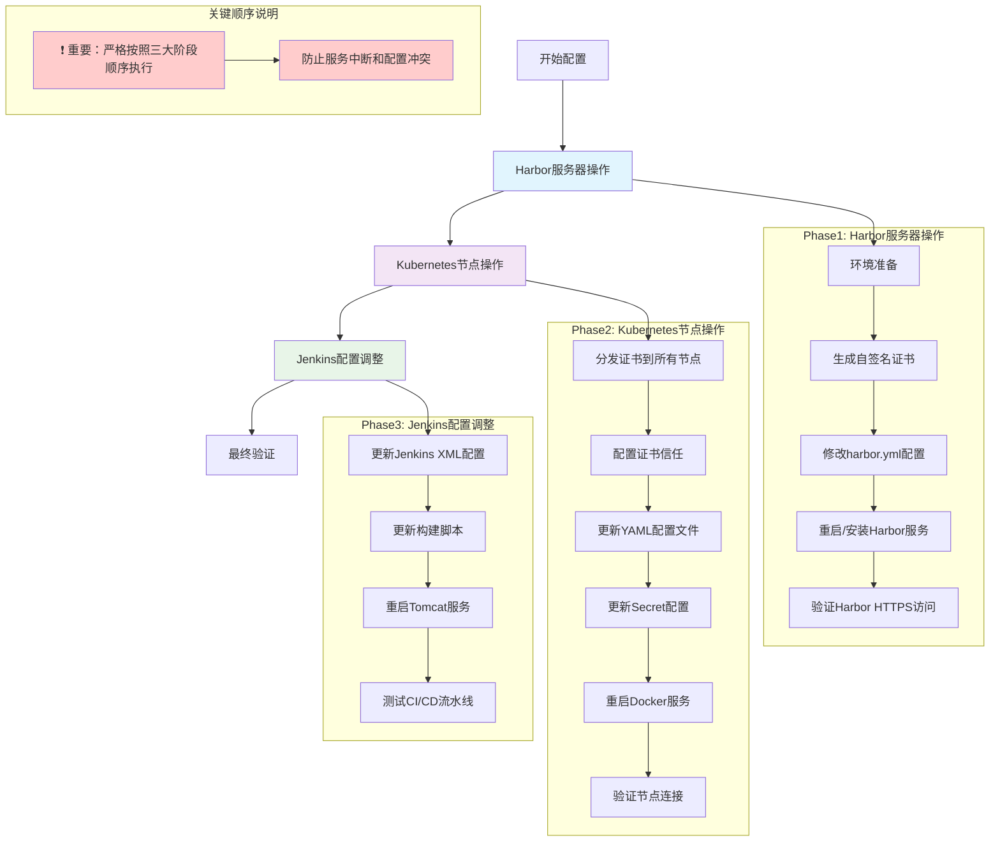
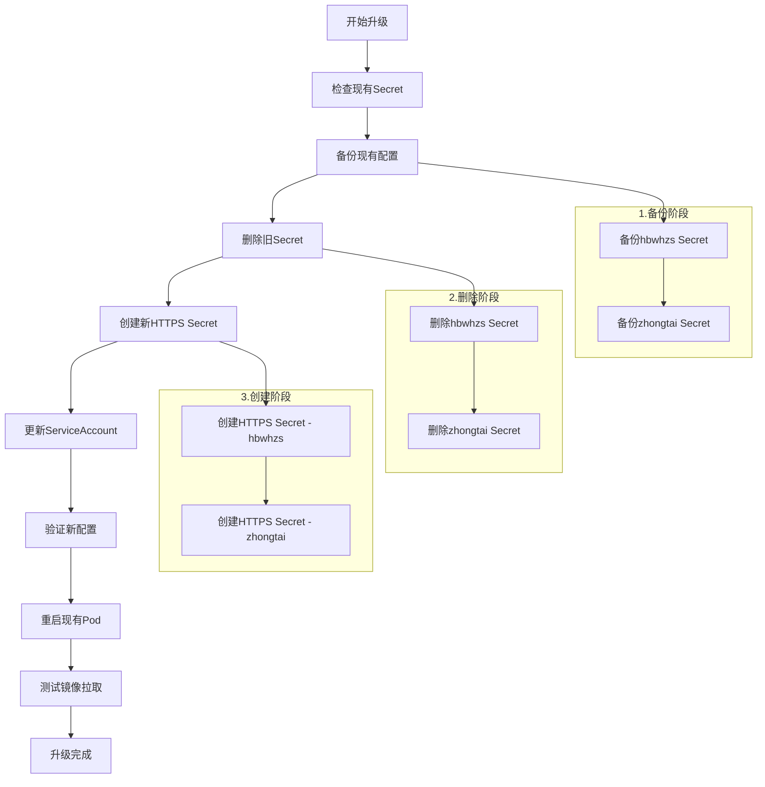

# Harbor 配置自签名 IP 证书指南

本指南将详细介绍如何在 Harbor 容器Registry中配置一个基于 IP 地址的自签名 HTTPS 证书。这适用于开发、测试环境或内部网络，当无法获取公共 CA 签发证书时，保障 Harbor 通信的安全性。

**重要：请严格按照以下三大阶段顺序执行，不可颠倒顺序！**
---
## ⚠️ **重要注意事项**

1. **阶段顺序不可颠倒**：必须先完成 Harbor 服务器配置，再配置 Kubernetes 节点，最后处理 Jenkins。

2. **Kubernetes 阶段内部顺序关键**：在 Kubernetes 阶段中，必须先更新 Secret，再重启 Docker。

3. **批量操作建议**：对于大型集群，建议使用 Ansible 或类似工具进行批量操作。

4. **IP 地址更换**：请将命令中的 `192.168.70.113` 替换为你的实际 Harbor IP 地址。

5. **备份重要性**：在执行批量修改之前，建议备份重要配置文件。

## Harbor HTTPS 配置变更流程



## 目录

- [Harbor 配置自签名 IP 证书指南](#harbor-配置自签名-ip-证书指南)
  - [目录](#目录)
  - [🏥 阶段一：Harbor服务器操作](#-阶段一harbor服务器操作)
    - [1. 环境准备](#1-环境准备)
    - [2. 生成自签名 IP 证书](#2-生成自签名-ip-证书)
      - [2.1 创建证书存储目录](#21-创建证书存储目录)
      - [2.2 创建 openssl.cnf 配置文件](#22-创建-opensslcnf-配置文件)
      - [2.3 生成私钥和证书](#23-生成私钥和证书)
    - [3. 配置 Harbor 使用自签名证书](#3-配置-harbor-使用自签名证书)
      - [3.1 修改 harbor.yml 文件](#31-修改-harboryml-文件)
      - [3.2 重新安装或重启 Harbor](#32-重新安装或重启-harbor)
      - [3.3 验证 Harbor HTTPS](#33-验证-harbor-https)
  - [🔐 阶段二：Kubernetes节点操作](#-阶段二kubernetes节点操作)
    - [1. 分发证书到所有节点](#1-分发证书到所有节点)
    - [2. 配置证书信任](#2-配置证书信任)
    - [3. 批量更新YAML配置文件](#3-批量更新yaml配置文件)
    - [4. 更新Secret配置](#4-更新secret配置)
    - [5. 重启Docker服务](#5-重启docker服务)
    - [6. 验证节点连接](#6-验证节点连接)
    - [7. 配置 Kubernetes 私有仓库访问补充说明](#7-配置-kubernetes-私有仓库访问补充说明)
      - [7.1 配置原理说明](#71-配置原理说明)
      - [7.2 升级场景：从 HTTP 升级到 HTTPS](#72-升级场景从-http-升级到-https)
      - [7.3 最终验证](#73-最终验证)
  - [🛠️ 阶段三：Jenkins 配置调整](#️-阶段三jenkins-配置调整)
    - [1. 更新 Jenkins XML 配置文件](#1-更新-jenkins-xml-配置文件)
    - [2. 更新构建脚本中的 Harbor 地址](#2-更新构建脚本中的-harbor-地址)
    - [3. 重启 Tomcat/Jenkins 服务](#3-重启-tomcatjenkins-服务)
    - [4. 测试 CI/CD 流水线](#4-测试-cicd-流水线)
  - [常见问题与注意事项](#常见问题与注意事项)

---

## 🏥 **阶段一：Harbor服务器操作**

这一阶段在 **Harbor 服务器** 上执行，完成以下任务：
- 环境准备和前置条件检查
- 生成自签名 SSL 证书
- 配置 Harbor 使用 HTTPS 证书
- 重启 Harbor 服务并验证 HTTPS 访问

### 1. 环境准备

在开始之前，请确保满足以下条件：

- **Harbor 服务器：** 已经安装了 Docker 和 Docker Compose，并且准备安装 Harbor 或已有 Harbor 实例。
- **OpenSSL：** Harbor 服务器上已安装 `openssl` 工具（通常 Linux 系统自带）。
- **Harbor IP 地址：** 明确你的 Harbor 服务器的 IP 地址，例如 `192.168.70.113`。
- **管理员权限：** 拥有 Harbor 服务器和所有客户端机器的 `root` 或 `sudo` 权限。
- **harbor.yml 文件：** 已下载或准备好 Harbor 的 `harbor.yml` 配置文件。

### 2. 生成自签名 IP 证书

这一步骤将在 Harbor 服务器上生成用于 HTTPS 加密的私钥 (`.key`) 和证书 (`.crt`)。

#### 2.1 创建证书存储目录

建议在 Harbor 安装目录内创建一个专门的目录来存放证书文件。

  ```bash
  # 假设Harbor的安装目录是 /data/harbor
  # 进入Harbor安装目录
  cd /data/harbor
  # 创建证书目录
  mkdir -p ./certs
  # 进入证书目录
  cd ./certs
  ```

  **注意：** 如果你的Harbor安装在其他目录（如 `/home/shineyue/harbor/`），请相应调整路径：
  ```bash
  # 示例：如果Harbor在 /home/shineyue/harbor/ 目录
  cd /home/shineyue/harbor/data
  mkdir -p ./certs
  cd ./certs
  ```

#### 2.2 创建 openssl.cnf 配置文件

创建一个 `openssl.cnf` 文件，指定证书的详细信息，特别是其 IP 地址（Subject Alternative Name, SAN）。

将 `<你的HarborIP地址>` 替换为你的 Harbor 服务器的实际 IP 地址。如果需要通过域名访问，也可以添加 `DNS.1`。

  ```bash
  # 创建 openssl.cnf 文件
  cat <<EOF > openssl.cnf
  [req]
  default_bits = 2048
  prompt = no
  default_md = sha256
  x509_extensions = v3_req
  distinguished_name = dn

  [dn]
  C = CN
  ST = HuBei
  L = Wuhan
  O = XC
  OU = IT Dept
  CN = 192.168.70.113 # 替换为你的HarborIP地址

  [v3_req]
  keyUsage = nonRepudiation, digitalSignature, keyEncipherment
  extendedKeyUsage = serverAuth
  subjectAltName = @alt_names

  [alt_names]
  # 如果是IP地址，用IP.1 = <你的HarborIP地址>
  IP.1 = 192.168.70.113 # 替换为你的HarborIP地址
  # 如果你的Harbor也有域名，可以加上，例如：
  # DNS.1 = whgjj.harbor.local
  EOF
  ```

#### 2.3 生成私钥和证书

使用 `openssl` 命令根据 `openssl.cnf` 文件生成私钥 (`harbor.key`) 和证书 (`harbor.crt`)。

  ```bash
  # 在 /data/harbor/certs 目录下执行以下命令（或你的实际证书目录）

  # 1. 生成私钥 (harbor.key)
  openssl genrsa -out harbor.key 2048

  # 2. 生成自签名证书 (harbor.crt)，有效期为3650天（10年）
  openssl req -x509 -new -nodes -key harbor.key -sha256 -days 3650 -out harbor.crt -config openssl.cnf -extensions v3_req

  # 3. 设置私钥权限，确保只有所有者可读写
  chmod 600 harbor.key

  echo "证书和私钥已成功生成在当前目录：harbor.key 和 harbor.crt"
  ```

### 3. 配置 Harbor 使用自签名证书

这一步骤将修改 Harbor 的配置文件，使其启动时使用刚才生成的证书。

#### 3.1 修改 harbor.yml 文件

编辑 Harbor 安装目录下的 `harbor.yml` 文件。

  ```bash
  cd /data/harbor # 确保你在Harbor安装目录
  vim harbor.yml
  ```

找到以下配置项并进行修改：

- **`hostname`：** 必须与证书中的 `CN` 和 `IP.1` 指定的 IP 地址完全一致。
- **`https_port`：** 确保此项没有被注释掉，通常保持默认 `443`。
- **`certificate`：** 指向 `harbor.crt` 文件的绝对路径，并确保取消注释。
- **`private_key`：** 指向 `harbor.key` 文件的绝对路径，并确保取消注释。

  ```yaml
  # --------- General configuration --------------------------------
  hostname: 192.168.70.113 # 替换为你的HarborIP地址，必须和证书IP一致

  # The HTTP port. If not set, it will be 80.
  # http_port: 80 # 如果需要指定HTTP端口，保持默认或取消注释

  # The HTTPS port. If not set, it will be 443.
  https_port: 443 # 确保此项没有被注释掉，启用HTTPS

  # The certificate and key files for Harbor.
  # The certificate path must be an absolute path.
  # certificate: /your/path/to/harbor.crt  # <-- 找到这两行
  # private_key: /your/path/to/harbor.key  # <-- 找到这两行

  # 将上面两行注释取消，并更新为你的证书和私钥的绝对路径：
  certificate: /data/harbor/certs/harbor.crt # 替换为你的cert文件绝对路径
  private_key: /data/harbor/certs/harbor.key # 替换为你的key文件绝对路径

  # ... 其他配置保持不变或根据需要修改 ...
  ```

保存并关闭 `harbor.yml` 文件。

#### 3.2 重新安装或重启 Harbor

- **如果是首次安装 Harbor：**

    ```bash
    cd /data/harbor # 确保你在Harbor安装目录
    ./install.sh # 或者 ./install.sh -P 如果需要提示输入admin密码
    ```

- **如果 Harbor 已经运行：**

    为了确保配置完全生效，建议先停止 Harbor，清理旧数据（如果需要，特别是数据库），然后再启动。

    ```bash
    cd /data/harbor # 确保你在Harbor安装目录

    # 停止并删除所有Harbor容器及数据卷 (慎重：-v 会删除数据卷，如果只想重启不丢数据，请勿加 -v)
    docker-compose down -v

    # 重新启动Harbor，Harbor会自动加载新的配置
    ./install.sh
    # 或者如果不想重新运行install.sh (较少用，一般直接用install.sh更保险)
    # docker-compose up -d
    ```

    **重要：** 如果你的客户端之前配置了HTTP不安全注册表，需要更新 `/etc/docker/daemon.json` 文件：
    ```json
    {
     "exec-opts": ["native.cgroupdriver=cgroupfs"],
     "insecure-registries": ["192.168.70.113"]
    }
    ```
    然后重新加载配置：
    ```bash
    sudo systemctl daemon-reload
    sudo systemctl restart docker
    ```

#### 3.3 验证 Harbor HTTPS

待 Harbor 容器全部启动后，等待几分钟，然后尝试通过浏览器访问你的 Harbor IP 地址：`https://192.168.70.113`。

你可能会看到浏览器的安全警告（因为是自签名证书），点击"高级"或"继续访问"即可进入 Harbor 登录界面。如果能正常显示登录页面，则说明 Harbor HTTPS 配置成功。

**进一步验证 - Docker 登录测试：**

在 Harbor 服务器上或其他已配置证书信任的机器上，进行 Docker 登录测试：

```bash
# 在Harbor服务器上测试（如果尚未配置证书信任，可能需要加 --insecure 参数）
docker login 192.168.70.113

# 或者使用完整的HTTPS URL
docker login https://192.168.70.113

# 输入你的Harbor管理员账户
# Username: admin
# Password: [你的密码]
```

如果登录成功，会显示：
```
Login Succeeded
```

如果登录失败，可能需要：
1. 检查证书配置是否正确
2. 确认Harbor服务已完全启动
3. 检查防火墙设置
4. 验证用户名和密码

---

## 🔐 **阶段二：Kubernetes节点操作**

这一阶段在 **每个 Kubernetes 节点**（Master和Worker）上执行，完成以下任务：
- 分发证书到所有节点
- 配置证书信任
- 批量更新YAML配置文件
- 更新Secret配置（关键步骤）
- 验证节点连接
- 重启Docker服务（最后执行）

### 1. 分发证书到所有节点

为了让 Docker 客户端（包括 Kubernetes 节点上的容器运行时）能够安全地与你的 Harbor 建立连接，你需要让它们信任你 Harbor 服务器的自签名证书。这需要将 `harbor.crt` 分发到**所有**需要访问 Harbor 的客户端机器上。

#### 1.1 分发证书到所有节点

- 将 Harbor 服务器上 `/data/harbor/certs/harbor.crt` 文件拷贝到所有客户端机器上。你可以使用 `scp` 命令：

    ```bash
    # 在客户端机器上执行
    scp <Harbor用户名>@<Harbor服务器IP>:/data/harbor/certs/harbor.crt /tmp/harbor.crt
    # 示例：scp root@192.168.70.113:/data/harbor/certs/harbor.crt /tmp/harbor.crt
    ```

### 2. 配置证书信任

**重要：** 对于 Kubernetes 集群，你需要对集群中的**每个 Master 节点和 Worker 节点**都执行以下证书配置。这一步骤确保所有节点的 Docker 客户端都能识别和信任 Harbor 的自签名证书。

**操作原理：**
- Docker 客户端需要验证 Harbor 服务器的 SSL 证书
- 自签名证书需要手动添加到信任列表
- 不同的容器运行时需要不同的配置方式

**批量操作建议：** 对于大规模集群，推荐使用像 Ansible、SaltStack 或 Cloud-init 等配置管理工具进行自动化部署。

#### 2.1 对 Docker 容器运行时的节点

如果你的 Kubernetes 节点使用 Docker 作为容器运行时，需要在每个节点上配置 Docker 的证书信任。

 **在每个 Kubernetes 节点上执行以下操作：**

```bash
# 1. 创建 Docker 证书目录（按 Harbor IP 地址组织）
sudo mkdir -p /etc/docker/certs.d/192.168.70.113/  # 替换为你的HarborIP地址

# 2. 拷贝证书文件并重命名为 ca.crt
sudo cp /tmp/harbor.crt /etc/docker/certs.d/192.168.70.113/ca.crt

# 3. 验证证书文件权限（可选）
ls -la /etc/docker/certs.d/192.168.70.113/
```

**说明：**
- `/etc/docker/certs.d/` 目录用于存放 Docker 客户端的证书信任配置
- 必须使用 Harbor 的实际 IP 地址作为目录名
- 证书文件必须命名为 `ca.crt`

#### 2.2 对 Containerd 或 CRI-O 容器运行时的节点

如果你的 Kubernetes 节点使用 Containerd 或 CRI-O 作为容器运行时，需要配置系统级的证书信任。

**在每个 Kubernetes 节点上执行以下操作：**

```bash
# 1. 将证书添加到系统信任列表
# 对于 CentOS/RHEL/Fedora：
sudo cp /tmp/harbor.crt /etc/pki/ca-trust/source/anchors/
sudo update-ca-trust

# 对于 Ubuntu/Debian：
# sudo cp /tmp/harbor.crt /usr/local/share/ca-certificates/harbor.crt
# sudo update-ca-certificates

# 2. 验证证书是否生效
openssl s_client -connect 192.168.70.113:443 -verify_return_error
```

**说明：**
- Containerd 和 CRI-O 使用系统级的 CA 证书存储
- 不同操作系统的证书存储路径和更新命令不同
- 更新后需要验证证书是否正确被系统识别
### 3. 批量更新YAML配置文件

进入 Kubernetes 的 master 节点，批量修改YAML配置文件：

```bash
# 在 Kubernetes master 服务器上执行 (192.168.18.130)
cd /home
# 更新所有 YML 配置文件中的 Harbor 地址
find . -type f -name "*.yml" -print0 | xargs -0 sed -i 's/192.168.70.113:80/192.168.70.113/g'

echo "k8s YML配置更新完成"
```

### 4. 更新Secret配置（关键步骤）

删除现有的 harbor-secret：

```bash
# 备份现有配置（可选）
kubectl get secret harbor-secret -n hbwhzs -o yaml > harbor-secret-hbwhzs-backup.yaml
kubectl get secret harbor-secret -n zhongtai -o yaml > harbor-secret-zhongtai-backup.yaml

# 删除现有的 harbor-secret
kubectl delete secret harbor-secret -n hbwhzs
kubectl delete secret harbor-secret -n zhongtai
```

删除完成后，继续按照下面的步骤重新创建新的 HTTPS Secret。

#### 4.1 配置 hbwhzs 命名空间

1. **创建 Docker Registry Secret：**

    ```bash
    kubectl create secret docker-registry harbor-secret \
      --docker-server=192.168.70.113 \
      --docker-username='robot_docker' \
      --docker-password='XXXXXXXXXXXX' \
      -n hbwhzs
    ```

2. **将 Secret 关联到默认 ServiceAccount：**

    ```bash
    kubectl patch serviceaccount default \
      -p '{"imagePullSecrets": [{"name": "harbor-secret"}]}' \
      -n hbwhzs
    ```

#### 4.2 配置 zhongtai 命名空间

1. **创建 Docker Registry Secret：**

    ```bash
    kubectl create secret docker-registry harbor-secret \
      --docker-server=192.168.70.113 \
      --docker-username='robot_docker' \
      --docker-password='XXXXXXXXXXXX' \
      -n zhongtai
    ```

2. **将 Secret 关联到默认 ServiceAccount：**

    ```bash
    kubectl patch serviceaccount default \
      -p '{"imagePullSecrets": [{"name": "harbor-secret"}]}' \
      -n zhongtai
    ```

#### 4.3 验证配置

配置完成后，可以通过以下方式验证：

1. **检查 Secret 是否创建成功：**

    ```bash
    kubectl get secrets -n hbwhzs | grep harbor-secret
    kubectl get secrets -n zhongtai | grep harbor-secret
    ```

2. **检查 ServiceAccount 配置：**

    ```bash
    kubectl get serviceaccount default -n hbwhzs -o yaml
    kubectl get serviceaccount default -n zhongtai -o yaml
    ```
### 5. 重启Docker服务（关键步骤）

**重要说明：** 在所有 Kubernetes 节点（包括 Master 节点和 Worker 节点）上执行 Docker 服务重启。这是整个阶段二的关键步骤，确保所有证书配置和 Secret 更新都生效。

**执行顺序：**
1. 先在 Worker 节点上执行
2. 再在 Master 节点上执行
3. 确保集群服务稳定后进行验证

```bash
# 在每个 Kubernetes 节点上执行（先 Worker 后 Master）
systemctl restart docker

# 验证 Docker 服务状态
systemctl status docker
```

**注意事项：**
- 重启 Docker 会导致该节点上的所有容器重启
- 建议在业务低峰期执行
- 重启后需要等待所有 Pod 重新调度完成
- 如果是生产环境，建议逐个节点操作，确保服务可用性

### 6. 验证节点连接

重启 Docker 服务后，验证各节点是否能正常连接 Harbor：

```bash
# 在每个 Kubernetes 节点上测试
docker login 192.168.70.113

# 或者使用完整的HTTPS URL
docker login https://192.168.70.113

# 输入你的Harbor管理员账户
# Username: admin
# Password: [你的密码]
```

**验证结果：**
- 如果登录成功，会显示：`Login Succeeded`
- 如果登录失败，可能需要：
  1. 检查证书配置是否正确
  2. 确认Harbor服务已完全启动
  3. 检查防火墙设置
  4. 验证用户名和密码

### 7. 配置 Kubernetes 私有仓库访问补充说明

本节提供关于 Harbor 私有仓库访问配置的补充说明和高级场景处理。

#### 7.1 配置原理说明

当 Harbor 仓库设置为私有访问时，Kubernetes 集群需要配置相应的认证信息才能从 Harbor 拉取镜像。主要涉及以下组件：

- **Docker Registry Secret：** 存储 Harbor 认证信息
- **ServiceAccount：** 关联 imagePullSecrets 实现自动认证
- **Pod 配置：** 通过 ServiceAccount 继承认证信息

#### 7.2 升级场景：从 HTTP 升级到 HTTPS

如果您之前已经为 HTTP 版本的 Harbor 创建过 `harbor-secret`，现在升级到 HTTPS 后，需要删除旧的 Secret 并重新创建。这是因为 Docker registry secret 中存储的服务器地址信息需要更新。

**HTTP到HTTPS升级流程：**



#### 7.3 最终验证

在完成所有配置后，进行最终验证：

1. **检查 Secret 状态：**

    ```bash
    kubectl get secrets -n hbwhzs | grep harbor-secret
    kubectl get secrets -n zhongtai | grep harbor-secret
    ```

2. **检查 ServiceAccount 配置：**

    ```bash
    kubectl get serviceaccount default -n hbwhzs -o yaml
    kubectl get serviceaccount default -n zhongtai -o yaml
    ```

3. **测试 Pod 镜像拉取：**

    ```bash
    # 创建测试 Pod
    kubectl run test-pod --image=192.168.70.113/library/nginx:latest -n hbwhzs
    
    # 检查 Pod 状态
    kubectl get pods -n hbwhzs
    
    # 清理测试 Pod
    kubectl delete pod test-pod -n hbwhzs
    ```

---

## 🛠️ **阶段三：Jenkins 配置调整**

这一阶段在 **Jenkins 服务器** 上执行，完成以下任务：
- 更新Jenkins XML配置文件
- 更新构建脚本中的Harbor地址
- 重启Tomcat/Jenkins服务
- 测试CI/CD流水线

### 1. 更新 Jenkins XML 配置文件

```bash
# 在 Jenkins 服务器上执行
# 更新所有 XML 配置文件中的 Harbor 地址
find . -type f -name "*.xml" -print0 | xargs -0 sed -i 's/192.168.70.113:80/192.168.70.113/g'

echo "Jenkins XML配置更新完成"
```

### 2. 更新构建脚本中的 Harbor 地址

```bash
# 更新 Jenkins 构建脚本中的 Harbor 地址引用
# 这可能包括 Jenkinsfile、shell 脚本等
find . -type f \( -name "Jenkinsfile" -o -name "*.sh" -o -name "*.groovy" \) -print0 | \
  xargs -0 sed -i 's/192.168.70.113:80/192.168.70.113/g'

echo "构建脚本更新完成"
```

### 3. 重启 Tomcat/Jenkins 服务

```bash
# 重启 Jenkins/Tomcat 服务（根据实际安装路径调整）
sh /home/shineyue/Tomcat/bin/shutdown.sh && sh /home/shineyue/Tomcat/bin/startup.sh

echo "Jenkins 服务重启完成"
```

### 4. 测试 CI/CD 流水线

```bash
# 在 Jenkins 中手动触发一个测试构建
# 验证构建过程中能正常 push/pull 镜像到 Harbor
echo "CI/CD 流水线测试完成"
```

---

## 常见问题与注意事项

### 执行顺序相关

- **整体流程：** 请参考文档开头的流程图，按照顺序执行各个步骤，确保每个阶段都正确完成后再进行下一步。
- **❗ 三大阶段顺序：** 必须严格遵循 **Harbor服务器 → Kubernetes节点 → Jenkins配置** 的顺序。不可颠倒或跳过任何阶段。
- **❗ Kubernetes阶段内部顺序：** 在Kubernetes阶段中，必须先更新Secret配置，再重启Docker服务。如果先重启Docker，会导致所有Pod重启但Secret还是旧的，造成所有Pod拉取镜像失败。

### 网络和安全配置

- **防火墙：** 确保 Harbor 服务器的 80 (HTTP) 和 443 (HTTPS) 端口已在防火墙中开放。
- **`hostname` 匹配：** `harbor.yml` 中的 `hostname` 必须与 `openssl.cnf` 中的 `CN` 和 `IP.1` （或 `DNS.1`）完全匹配，否则证书验证会失败。
- **证书过期：** 自签名证书有有效期（本例中为 3650 天）。过期后，所有客户端将无法连接 Harbor，需要重新生成并替换证书。

### 服务配置和管理

- **HTTP 到 HTTPS 重定向：** Harbor 启用 HTTPS 后，会自动将所有 HTTP 请求重定向到 HTTPS。因此，客户端应始终尝试通过 HTTPS 访问。
- **配置文件分类处理：** YAML文件在Kubernetes阶段处理，XML文件在Jenkins阶段处理，避免混乱。
- **服务重启阶段化：** Docker服务在Kubernetes阶段重启，Tomcat/Jenkins服务在Jenkins阶段重启。

### 验证和测试

- **验证步骤：** 在每个阶段完成后，除了浏览器验证外，必须进行 `docker login` 测试以确保命令行工具可以正常访问。
- **升级流程：** 对于从 HTTP 升级到 HTTPS 的场景，请参考 7.2 节中的流程图，按照步骤顺序执行。

### 生产环境考虑

- **批量操作建议：** 对于大型集群，建议使用 Ansible、Terraform 或类似自动化工具进行批量部署。
- **生产环境警告：** 自签名证书不适合生产环境。生产环境应使用由受信任的公共 CA（如 Let's Encrypt 或商业 CA）签发的证书。
- **高可用性：** 在生产环境中进行操作时，应考虑服务的高可用性，建议在业务低峰期执行，并做好备份和回滚准备。

### 故障排查

如果遇到问题，建议按以下顺序进行排查：

1. **检查证书配置**：确认证书文件路径和权限正确
2. **检查网络连接**：确认防火墙和端口配置
3. **检查服务状态**：确认 Harbor 和 Kubernetes 服务正常运行
4. **检查日志**：查看 Harbor、Docker 和 Kubernetes 的相关日志
5. **逐步排查**：从简单的 `docker login` 开始，逐步排查各个组件

---

**文档版本：** v1.2  
**最后更新：** 2024-08-26  
**适用场景：** Harbor HTTPS 证书配置、Kubernetes 集群集成、CI/CD 流水线配置

---
